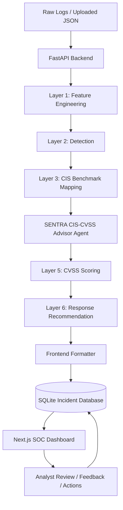

# Cyber Incident Response in Banking SOC

A full-stack **Security Operations Center (SOC) incident response platform** designed for banking-style cyber incident workflows.

The system takes raw security logs, processes them through a multi-layer SOC pipeline, detects suspicious activity, maps incidents to CIS benchmark controls, generates security recommendations, prepares CVSS scoring context, recommends response actions, and displays everything in an analyst-friendly dashboard.

---

## Overview

Banking environments generate large volumes of security telemetry from networks, web applications, identity systems, endpoints, databases, and cloud infrastructure. SOC analysts often need to manually connect these signals, identify threats, assess impact, and decide the correct response action.

This project solves that problem by building a structured incident response pipeline that converts raw logs into actionable SOC intelligence.

The platform helps answer key SOC questions:

* What happened?
* Which user, IP, host, or service was affected?
* Is the event suspicious or malicious?
* What type of threat does it represent?
* Which CIS benchmark or security control is relevant?
* What is the likely business and technical impact?
* What severity score should be assigned?
* What should the SOC team do next?

---

## What This Project Solves

This project focuses on reducing manual SOC triage effort by automating the core stages of incident analysis and response.

It helps with:

* Log ingestion and normalization
* Feature extraction from raw events
* Threat and anomaly detection
* IOC and correlation analysis
* CIS benchmark recommendation
* CIS-based remediation guidance
* CVSS-style severity scoring
* Response playbook recommendation
* Analyst-friendly dashboard visualization
* Incident storage, review, and feedback tracking

The goal is to simulate how a banking SOC can move from raw telemetry to structured incident decisions.

---

## Key Features

* Multi-layer SOC pipeline architecture
* FastAPI backend for log upload and incident APIs
* Next.js frontend dashboard
* SQLite incident database
* Feature engineering for network, web, identity, IoT, and behavioral signals
* Detection layer with anomaly, threat-pattern, IOC, and correlation engines
* CIS benchmark mapping and remediation guidance
* Single-purpose AI recommendation agent for CIS and CVSS handoff
* CVSS-style scoring and severity classification
* Response playbook recommendation layer
* Analyst feedback and action tracking
* Sample incidents and generated output for demo use

---

## Agentic Component

The project includes a focused agentic layer called the:

## SENTRA CIS–CVSS Advisor Agent

Unlike a generic chatbot, this agent performs one practical SOC function:

> It takes the detection output and CIS benchmark mapping, generates a CIS-based security recommendation, and prepares structured CVSS scoring inputs for the next pipeline layer.

The agent helps bridge the gap between detection, security control mapping, and severity assessment.

### Agent Responsibilities

* Read the detected threat and supporting signals
* Identify the relevant CIS benchmark or control
* Generate a remediation recommendation
* Explain why the benchmark applies
* Prepare CVSS metric suggestions
* Forward structured context to the CVSS scoring layer

This keeps the system agentic through actual pipeline behavior rather than visual gimmicks.

---

## Architecture



---

## Layer-by-Layer Pipeline

### Layer 1: Feature Engineering

This layer takes raw logs and converts them into structured security events.

It performs:

* Log parsing
* Field normalization
* Timestamp normalization
* Log type classification
* Temporal feature extraction
* Behavioral feature extraction
* Network feature extraction
* Web feature extraction
* Identity feature extraction
* IoT feature extraction

The output is passed to the detection engine.

---

### Layer 2: Detection

This layer determines whether an event is benign, suspicious, or malicious.

It performs:

* Anomaly detection
* Threat pattern matching
* IOC enrichment
* Observable extraction
* Correlation analysis
* Suppression rule checks
* Final detection fusion

The output includes:

* Detection label
* Severity
* Confidence score
* Threat type
* Supporting signals
* Reasoning

---

### Layer 3: CIS Benchmark Mapping

This layer maps detected incidents to relevant CIS benchmark controls and security recommendations.

It provides:

* CIS benchmark ID
* Security framework
* Control title
* Control description
* Remediation guidance

This helps connect technical detections to recognized security best practices.

---

### Agent Layer: CIS–CVSS Advisor

This layer acts as a focused recommendation agent between CIS mapping and CVSS scoring.

It provides:

* CIS-based recommendation
* Recommendation rationale
* Matched benchmark context
* CVSS metric handoff
* Downstream readiness status

This allows the next layers to work with structured, explainable security context.

---

### Layer 5: CVSS Scoring

This layer estimates incident severity using CVSS-style logic.

It provides:

* Base score
* Severity rating
* CVSS vector string
* Exploitability mapping
* Impact mapping

This helps prioritize incidents based on risk.

---

### Layer 6: Response Recommendation

This layer recommends what the SOC team should do next.

It provides:

* Response priority
* Containment steps
* Recommended actions
* Playbook-style response guidance

Example response actions include:

* Block suspicious source IP
* Review exposed firewall rules
* Enable IDS alerts
* Isolate affected host
* Reset user credentials
* Escalate to SOC Tier-2

---

## Folder Structure

```text
Cyber-Incident-Response-in-Banking-SOC_final/
|
|-- Frontend/
|   |-- app/
|   |-- components/
|   |-- hooks/
|   |-- lib/
|   |-- public/
|
|-- layer_1_feature_engineering/
|   |-- engine_1_temporal/
|   |-- engine_2_behavioral/
|   |-- engine_3_statistical/
|   |-- engine_4_network/
|   |-- engine_5_web/
|   |-- engine_6_iot/
|   |-- engine_7_identity/
|
|-- layer_2_detection/
|   |-- engine_1_anomaly/
|   |-- engine_2_threat_analysis/
|   |-- engine_3_ioc_enrichment/
|   |-- engine_4_correlation/
|   |-- mappings/
|
|-- layer_3_cis/
|   |-- engines/
|   |-- mappings/
|   |-- tuxSOC-layer_CIS/
|
|-- layer_4_ai_analysis/
|   |-- agent/
|
|-- layer_5_cvss/
|   |-- engine_1_metric_mapping/
|   |-- engine_2_impact_mapping/
|   |-- engine_3_scoring/
|   |-- engine_4_validation/
|   |-- mappings/
|
|-- layer_6_response/
|   |-- response_layer/
|   |-- tests/
```

---

## Tech Stack

### Backend

* Python
* FastAPI
* SQLite
* Pydantic
* Uvicorn

### Frontend

* Next.js
* React
* TypeScript
* Tailwind CSS

### Security Pipeline

* Rule-based detection
* Anomaly scoring
* IOC enrichment
* CIS benchmark mapping
* CIS–CVSS recommendation agent
* CVSS-style scoring
* Response playbook logic

---

## How to Run the Project

### Prerequisites

* **Python 3.11+** and **Node.js 18+** (tested on Python 3.13 / Node 22)
* *(Optional)* **Ollama** with the `mistral` model for the Layer-4 LLM analysis.
  Without it, Layer 4 automatically falls back to deterministic rule-based
  analysis — the pipeline still runs end-to-end.
  ```bash
  ollama pull mistral        # only if you want real LLM analysis
  ```

### Quickest start (one command)

From the repo root, `./run.sh` sets up both venv + npm deps and launches the
backend (:8000) and frontend (:3000). Add `--prod` for a production build/serve,
`--seed` to pre-load demo data. Press Ctrl+C to stop.

```bash
./run.sh            # dev mode
./run.sh --prod     # production: uvicorn workers + next build && next start
```

### Manual setup

**1. Clone & configure**

```bash
git clone <repo-url> && cd Cyber-Incident-Response-in-Banking-SOC_final
cp .env.example .env          # adjust DB path, CORS origins, API key, Ollama URL…
```

**2. Backend (FastAPI)**

```bash
python3 -m venv .venv
source .venv/bin/activate          # Windows: .\.venv\Scripts\activate
pip install -r requirements.txt
uvicorn api_server:app --host 127.0.0.1 --port 8000
```

API docs: `http://127.0.0.1:8000/docs` · health: `http://127.0.0.1:8000/healthz`

**3. Frontend (Next.js)** — in a new terminal

```bash
cd Frontend
npm install
npm run dev                        # dev
# or for production: npm run build && npm run start
```

Open `http://localhost:3000` (redirects to the live dashboard).

### Docker (production)

```bash
docker compose up --build          # backend :8000, frontend :3000, ollama :11434
docker compose exec ollama ollama pull mistral   # optional, for LLM analysis
```

### Configuration (environment variables)

All deployment-specific settings are env-driven (see `.env.example`):
`SOC_DB_PATH`, `SOC_CORS_ORIGINS`, `SOC_API_KEY` (enables `X-API-Key` auth on all
endpoints when set), `SOC_MAX_UPLOAD_BYTES`, `SOC_MAX_EVENTS`, `OLLAMA_BASE_URL`,
`OLLAMA_MODEL`, `SOC_LOG_LEVEL`; and for the frontend `BACKEND_URL` / `BACKEND_API_KEY`.

---

## How to Use

1. Start the backend server.
2. Start the frontend dashboard.
3. Open the dashboard in the browser.
4. Upload a JSON log file or use the included sample incident data.
5. Review generated incidents.
6. Open an incident to inspect:

   * Raw event details
   * Feature engineering output
   * Detection output
   * CIS benchmark recommendation
   * CIS–CVSS advisor recommendation
   * CVSS score
   * Response recommendation
7. Submit analyst feedback or update response actions if needed.

---

## Main Backend API Endpoints

| Method   | Endpoint                             | Description                               |
| -------- | ------------------------------------ | ----------------------------------------- |
| `POST`   | `/run-pipeline`                      | Upload logs and run the full SOC pipeline |
| `GET`    | `/api/incidents`                     | Get all stored incidents                  |
| `GET`    | `/api/incidents/{event_id}`          | Get one incident by ID                    |
| `POST`   | `/api/incidents/{event_id}/action`   | Update incident action/status             |
| `POST`   | `/api/incidents/{event_id}/feedback` | Submit analyst feedback                   |
| `GET`    | `/api/incidents/{event_id}/feedback` | Get analyst feedback                      |
| `POST`   | `/api/simulate`                      | Add simulated incident events             |
| `DELETE` | `/api/incidents`                     | Clear stored incidents                    |
| `GET`    | `/api/suppression-rules`             | View suppression rules                    |

---

## Example Incident Output

Each processed incident can include:

* Event ID
* Timestamp
* Source IP
* Destination IP
* Affected user or host
* Threat type
* Detection confidence
* Severity
* CIS benchmark recommendation
* CIS–CVSS advisor output
* CVSS score
* Response priority
* Recommended containment steps
* Final dashboard summary

---

## Sample Data

The repository includes sample data and pre-generated outputs for testing and demonstration.

These allow the dashboard and backend to work with sample incidents even before uploading new logs.

Sample data supports:

* Pipeline testing
* Dashboard preview
* Incident review
* Demo walkthroughs
* API validation

---

## Why This Matters for Banking SOCs

Banking environments are high-value targets and require fast, accurate incident response. SOC teams must quickly identify whether an event is benign, suspicious, or malicious, then determine impact, severity, and response priority.

This project demonstrates how layered automation can support analysts by:

* Reducing manual triage time
* Connecting related signals
* Providing consistent incident scoring
* Mapping detections to security controls
* Generating structured recommendations
* Improving incident visibility through a dashboard

---

## Future Improvements

Planned improvements could include:

* Real-time log streaming
* PostgreSQL database support
* Authentication and role-based access control
* SIEM integration
* EDR integration
* Firewall automation
* Threat intelligence feed integration
* MITRE ATT&CK mapping
* Analyst audit logs
* Docker-based deployment
* Cloud deployment support
* Advanced model-backed incident analysis

---

## Project Summary

**Cyber Incident Response in Banking SOC** is a full-stack cybersecurity project that demonstrates how raw security logs can be transformed into structured incident intelligence.

It combines:

* Backend APIs
* Multi-layer security analysis
* Detection engineering
* CIS benchmark mapping
* Agentic recommendation generation
* CVSS-style severity scoring
* Response recommendation
* Frontend visualization

The project is designed as a practical SOC simulation for banking incident response workflows.
